# Обзор
`EventHandler` - это основной класс для обработки входящих событий от платформы MAX. Он предоставляет удобный интерфейс для регистрации обработчиков различных типов событий (сообщения, callback-запросы, изменения в чатах и т.д.) и их последующего выполнения.

**Пространство имен**: garmayev\max

**Наследование**: Нет

# Содержание
- [Архитектура и принцип работы](#архитектура-и-принцип-работы)
  - [Методы класса](#методы-класса)
  - [Инициализация](#инициализация)
  - [Регистрация обработчиков событий](#регистрация-обработчиков-событий)
  - [Специализированные обработчики](#специализированные-обработчики)
  - [Обработчики команд и шаблонов](#обработчики-команд-и-шаблонов)
  - [Вспомогательные методы](#вспомогательные-методы)
- [Типы событий](#типы-событий)
- [Примеры использования](#примеры-использования)
- [Практические сценарии](#практические-сценарии)

## Архитектура и принцип работы
`EventHandler` работает по следующему принципу:

`Инициализация` - парсинг входящего запроса из php://input

`Регистрация обработчиков` - привязка callback-функций к типам событий

`Обработка` - последовательный вызов зарегистрированных обработчиков

`Остановка` - возможность прервать цепочку обработчиков при успешной обработке



## Методы класса
### Инициализация
`__construct(MaxBase $bot)`
Конструктор класса. Принимает экземпляр бота для доступа к API.

**Параметры:**

`$bot` (MaxBase) - Экземпляр класса Max или MaxBase

**Пример:**

```php
$eventHandler = new EventHandler($bot);
```

`init(): self`

Инициализирует обработчик, парсит входящий запрос. Должен быть вызван перед использованием других методов.

**Возвращает:** self - для цепочки вызовов

**Пример:**

```php
$bot->handler()->init()->onMessage(function($update) {
    // Обработка
})->run();
```

### Регистрация обработчиков событий
on(string $eventType, callable $handler): self
Регистрирует обработчик для определенного типа события. Это базовый метод для всех обработчиков.

**Параметры:**

`$eventType` (`string`) - Тип события (константы из Update)

`$handler` (`callable`) - Функция-обработчик, принимающая Request

**Возвращает:** `self` - для цепочки вызовов

**Пример:**

```php
$handler->on(Update::TYPE_MESSAGE_CREATED, function(Request $request) {
    $message = $request->getMessage();
    // Обработка сообщения
});
```

`onMessage(callable $handler): self`
Регистрирует обработчик для входящих сообщений.

**Параметры:**

`$handler` (`callable`) - Функция-обработчик, принимающая Request

**Возвращает:** self - для цепочки вызовов

**Пример:**

```php
$handler->onMessage(function(Request $request) {
    $text = $request->getMessage()->getBody()->getText();
    echo "Получено сообщение: $text";
});
```

`onCallback(callable $handler): self`
Регистрирует обработчик для callback-запросов (нажатие на кнопки).

**Параметры:**

`$handler` (`callable`) - Функция-обработчик, принимающая Request

**Возвращает:** self - для цепочки вызовов

**Пример:**

```php
$handler->onCallback(function(Request $request) {
    $callback = $request->getCallback();
    $payload = $callback->getPayload();
    // Обработка нажатия кнопки
});
```

`onMessageEdited(callable $handler): self`

Регистрирует обработчик для редактирования сообщений.

**Параметры:**

`$handler` (`callable`) - Функция-обработчик

**Возвращает:** self - для цепочки вызовов

`onMessageRemoved(callable $handler): self`

Регистрирует обработчик для удаления сообщений.

**Параметры:**

`$handler` (`callable`) - Функция-обработчик

**Возвращает:** self - для цепочки вызовов

`onBotAdded(callable $handler): self`

Регистрирует обработчик для события добавления бота в чат.

**Параметры:**

`$handler` (`callable`) - Функция-обработчик

**Возвращает:** self - для цепочки вызовов

**Пример:**

```php
$handler->onBotAdded(function(Request $request) {
    $chat = $request->getMessage()->getRecipient();
    // Бот добавлен в чат с ID: $chat->getChat_id()
});
```

`onBotRemoved(callable $handler): self`
Регистрирует обработчик для события удаления бота из чата.

**Параметры:**

`$handler` (`callable`) - Функция-обработчик

**Возвращает:** self - для цепочки вызовов

`onBotStarted(callable $handler): self`

Регистрирует обработчик для старта бота (начало диалога).

**Параметры:**

`$handler` (`callable`) - Функция-обработчик

**Возвращает:** self - для цепочки вызовов

`onBotStopped(callable $handler): self`

Регистрирует обработчик для остановки бота.

**Параметры:**

`$handler` (`callable`) - Функция-обработчик

**Возвращает:** self - для цепочки вызовов

`onUserAdded(callable $handler): self`

Регистрирует обработчик для добавления пользователя в чат.

**Параметры:**

`$handler` (`callable`) - Функция-обработчик

**Возвращает:** self - для цепочки вызовов

`onUserRemoved(callable $handler): self`

Регистрирует обработчик для удаления пользователя из чата.

**Параметры:**

`$handler` (`callable`) - Функция-обработчик

**Возвращает:** self - для цепочки вызовов

`onChatTitleChanged(callable $handler): self`

Регистрирует обработчик для изменения названия чата.

**Параметры:**

`$handler` (`callable`) - Функция-обработчик

**Возвращает:** self - для цепочки вызовов

`onChatCreated(callable $handler): self`

Регистрирует обработчик для создания чата.

**Параметры:**

`$handler` (`callable`) - Функция-обработчик

**Возвращает:** self - для цепочки вызовов

### Обработчики команд и шаблонов
`command(string $command, callable $handler): self`

Регистрирует обработчик для текстовых команд (начинающихся с / или !).

**Параметры:**

`$command` (`string`) - Имя команды (без символа / или !)

`$handler` (`callable`) - Функция-обработчик, принимающая Message и array $args

**Возвращает:** self - для цепочки вызовов

**Пример:**

```php
$handler->command('start', function(Message $message, array $args) {
    // Команда /start или !start
    $text = $message->getBody()->getText();
    // $args - аргументы команды
});
```

`callback(string $payload, callable $handler): self`

Регистрирует обработчик для callback с определенным payload.

**Параметры:**

`$payload` (`string`) - Значение payload для фильтрации

`$handler` (`callable`) - Функция-обработчик, принимающая Callback

**Возвращает:** self - для цепочки вызовов

**Пример:**

```php
$handler->callback('show_info', function(Callback $callback) {
    // Обработка нажатия кнопки с payload = 'show_info'
    $user = $callback->getUser();
    // Отправка информации пользователю
});
```

`contains(string $text, callable $handler): self`

Регистрирует обработчик для сообщений, содержащих определенную подстроку.

**Параметры:**

`$text` (`string`) - Текст для поиска (регистронезависимый)

`$handler` (`callable`) - Функция-обработчик, принимающая Message

**Возвращает:** self - для цепочки вызовов

**Пример:**

```php
$handler->contains('погода', function(Message $message) {
    // Сообщение содержит слово "погода"
    $user = $message->getSender();
    // Отправка прогноза погоды
});
```

`regex(string $pattern, callable $handler): self`

Регистрирует обработчик для сообщений, соответствующих регулярному выражению.

**Параметры:**

`$pattern` (`string`) - Регулярное выражение (с разделителями)

`$handler` (`callable`) - Функция-обработчик, принимающая Request и array $matches

**Возвращает:** self - для цепочки вызовов

**Пример:**

```php
$handler->regex('/^calc\s+([\d\+\-\*\/]+)$/i', function(Request $request, array $matches) {
    // Сообщение вида "calc 2+2"
    $expression = $matches[1];
    // Вычисление выражения
});
```

`default(callable $handler): self`

Регистрирует обработчик по умолчанию, который вызывается, если не сработали другие обработчики.

**Параметры:**

`$handler` (`callable`) - Функция-обработчик, принимающая Request

**Возвращает:** self - для цепочки вызовов

**Пример:**

```php
$handler->default(function(Request $request) {
    // Обработка всех неперехваченных событий
    $type = $request->getUpdate_type();
    Yii::debug("Необработанное событие: $type");
});
```

## Вспомогательные методы
`handle(): bool`

Запускает обработку входящего события. Вызывает все зарегистрированные обработчики в порядке их добавления.

**Возвращает:** bool - true, если событие было успешно обработано

**Пример:**

```php
$handler->handle();
```

### getRequest(): ?Request

Возвращает текущий объект запроса.

**Возвращает:** Request|null - Объект запроса или null

**Пример:**

```php
$request = $handler->getRequest();
if ($request) {
    $type = $request->getUpdate_type();
}
```

### getMessage(): ?Message
Возвращает сообщение из запроса (если доступно).

**Возвращает:** Message|null - Объект сообщения или null

**Пример:**

```php
$message = $handler->getMessage();
if ($message) {
    $text = $message->getBody()->getText();
}
```

### getCallback(): ?Callback
Возвращает callback из запроса (если доступно).

**Возвращает:** Callback|null - Объект callback или null

**Пример:**

```php
$callback = $handler->getCallback();
if ($callback) {
    $payload = $callback->getPayload();
}
```

### getChat(): ?Chat
Возвращает чат из запроса (если доступно).

**Возвращает:** Chat|null - Объект чата или null

**Пример:**

```php
$chat = $handler->getChat();
if ($chat) {
    $chatId = $chat->getChat_id();
    $chatType = $chat->getType();
}
```

### getUser(): ?User
Возвращает пользователя из запроса. Пытается получить из разных источников (user, message, callback).

**Возвращает:** User|null - Объект пользователя или null

**Пример:**

```php
$user = $handler->getUser();
if ($user) {
    $userId = $user->getUser_id();
    $name = $user->getDisplayName();
}
```

### parseCommandArgs(string $text): array
Парсит аргументы команды из текста сообщения.

**Параметры:**

`$text` (`string`) - Текст сообщения

**Возвращает:** array - Массив аргументов команды

**Пример:**

```php
$args = $handler->parseCommandArgs('/weather Moscow 5');
// Результат: ['Moscow', '5']
```

## Типы событий
Все типы событий определены в классе Update:

|Константа	|Значение	|Описание|
|--|--|--|
|TYPE_MESSAGE_CREATED	|message_created	|Создание нового сообщения|
|TYPE_MESSAGE_CALLBACK	|message_callback	|Нажатие на callback-кнопку|
|TYPE_MESSAGE_EDITED	|message_edited	|Редактирование сообщения|
|TYPE_MESSAGE_REMOVED	|message_removed	|Удаление сообщения|
|TYPE_BOT_ADDED	|bot_added	|Бот добавлен в чат|
|TYPE_BOT_REMOVED	|bot_removed	|Бот удален из чата|
|TYPE_BOT_STARTED	|bot_started	|Бот запущен|
|TYPE_BOT_STOPPED	|bot_stopped	|Бот остановлен|
|TYPE_USER_ADDED	|user_added	|Пользователь добавлен в чат|
|TYPE_USER_REMOVED	|user_removed	|Пользователь удален из чата|
|TYPE_DIALOG_MUTED	|dialog_mutated	|Диалог заглушен|
|TYPE_DIALOG_UNMUTED	|dialog_unmuted	|Диалог разглушен|
|TYPE_DIALOG_CLEARED	|dialog_cleared	|Диалог очищен|
|TYPE_DIALOG_REMOVED	|dialog_removed	|Диалог удален|
|TYPE_CHAT_TITLE_CHANGED	|chat_title_changed	|Изменено название чата|
|TYPE_MESSAGE_CHAT_CREATED	|message_chat_created	|Создан новый чат|

## Примеры использования
### Базовый пример
```php
$bot = new Max([
    'access_token' => 'YOUR_TOKEN',
    'secret' => 'YOUR_SECRET'
]);

$bot->handler()
    ->onMessage(function(Request $request) {
        $message = $request->getMessage();
        $user = $message->getSender();
        $text = $message->getBody()->getText();

        // Отправка ответа
        $this->bot->sendMessage(
            ['text' => "Вы написали: $text"],
            ['user_id' => $user->getUser_id()]
        );
    })
    ->onCallback(function(Request $request) {
        $callback = $request->getCallback();
        
        // Ответ на callback
        $this->bot->sendCallbackAnswer([
            'callback_id' => $callback->getCallback_id()
        ]);
    })
    ->default(function(Request $request) {
        // Обработка неперехваченных событий
        $type = $request->getUpdate_type();
        \Yii::debug("Необработанное событие: $type");
    })
    ->handle();
```
### Обработка команд
```php
$bot->handler()
    ->command('start', function(Message $message, array $args) {
        $user = $message->getSender();

        // Приветственное сообщение
        $this->bot->sendMessage([
            'text' => "Привет, {$user->getDisplayName()}! Добро пожаловать в бота!"
        ], ['user_id' => $user->getUser_id()]);
    })
    ->command('help', function(Message $message, array $args) {
        $user = $message->getSender();
        
        $this->bot->sendMessage([
            'text' => "Доступные команды:\n/start - Начать\n/help - Помощь\n/weather - Погода"
        ], ['user_id' => $user->getUser_id()]);
    })
    ->command('weather', function(Message $message, array $args) {
        $user = $message->getSender();
        $city = $args[0] ?? 'Москва';
        
        // Запрос погоды
        $this->bot->sendMessage([
            'text' => "Погода в $city: +25°C, солнечно"
        ], ['user_id' => $user->getUser_id()]);
    })
    ->handle();
```

### Обработка callback-кнопок
```php
$bot->handler()
    ->callback('show_info', function(Callback $callback) {
        $user = $callback->getUser();

        // Ответ на callback
        $this->bot->sendCallbackAnswer([
            'callback_id' => $callback->getCallback_id()
        ]);
        
        // Отправка информации
        $this->bot->sendMessage([
            'text' => "Ваш ID: {$user->getUser_id()}\nИмя: {$user->getDisplayName()}"
        ], ['user_id' => $user->getUser_id()]);
    })
    ->callback('delete', function(Callback $callback) {
        // Удаление сообщения
        $this->bot->sendCallbackAnswer([
            'callback_id' => $callback->getCallback_id()
        ]);
        // Действие удаления...
    })
    ->handle();
```

### Обработка по тексту и регулярным выражениям
```php
$bot->handler()
    ->contains('привет', function(Message $message) {
        $user = $message->getSender();
        $this->bot->sendMessage([
            'text' => "Приветствую, {$user->getDisplayName()}!"
        ], ['user_id' => $user->getUser_id()]);
    })
    ->regex('/^calc\s+([\d\+\-\*\/\(\)\.]+)$/', function(Request $request, array $matches) {
        $user = $request->getUser();
        $expression = $matches[1];

        try {
            $result = eval("return $expression;");
            $this->bot->sendMessage([
                'text' => "Результат: $result"
            ], ['user_id' => $user->getUser_id()]);
        } catch (\Exception $e) {
            $this->bot->sendMessage([
                'text' => "Ошибка в выражении"
            ], ['user_id' => $user->getUser_id()]);
        }
    })
    ->handle();
```
### Обработка событий чата
```php
$bot->handler()
    ->onBotAdded(function(Request $request) {
        $chat = $request->getMessage()->getRecipient();
        $user = $request->getUser();

        // Приветствие при добавлении в чат
        $this->bot->sendMessage([
            'text' => "Привет всем! Я бот для этого чата."
        ], ['chat_id' => $chat->getChat_id(), 'chat_type' => 'chat']);
    })
    ->onUserAdded(function(Request $request) {
        // Пользователь добавлен в чат
        $message = $request->getMessage();
        $user = $message->getSender();
        // Обработка...
    })
    ->onChatTitleChanged(function(Request $request) {
        // Изменено название чата
        $message = $request->getMessage();
        $chat = $message->getRecipient();
        // Обработка...
    })
    ->handle();
```

## Практические сценарии
### Сценарий 1: Бот-калькулятор
```php
$bot->handler()
    ->command('calc', function(Message $message, array $args) {
        $user = $message->getSender();
        $expression = implode(' ', $args);

        if (empty($expression)) {
            $this->bot->sendMessage([
                'text' => "Использование: /calc 2+2"
            ], ['user_id' => $user->getUser_id()]);
            return;
        }
        
        try {
            $result = eval("return $expression;");
            $this->bot->sendMessage([
                'text' => "$expression = $result"
            ], ['user_id' => $user->getUser_id()]);
        } catch (\Exception $e) {
            $this->bot->sendMessage([
                'text' => "Ошибка в выражении"
            ], ['user_id' => $user->getUser_id()]);
        }
    })
    ->handle();
```
### Сценарий 2: Бот с инлайн-клавиатурой
```php
use garmayev\max\types\Attachment;
use garmayev\max\types\buttons\Callback;

$bot->handler()
    ->command('menu', function(Message $message) {
        $user = $message->getSender();

        $keyboard = [
            'type' => Attachment::TYPE_INLINE_KEYBOARD,
            'payload' => [
                'buttons' => [
                    [
                        new Callback([
                            'text' => '📊 Статистика',
                            'payload' => 'stats'
                        ]),
                        new Callback([
                            'text' => '📝 Настройки',
                            'payload' => 'settings'
                        ])
                    ],
                    [
                        new Callback([
                            'text' => '❌ Закрыть',
                            'payload' => 'close'
                        ])
                    ]
                ]
            ]
        ];
        
        $this->bot->sendMessage([
            'text' => 'Выберите действие:',
            'attachments' => [$keyboard]
        ], ['user_id' => $user->getUser_id()]);
    })
    ->callback('stats', function(Callback $callback) {
        $user = $callback->getUser();
        $this->bot->sendCallbackAnswer([
            'callback_id' => $callback->getCallback_id()
        ]);
        
        $this->bot->sendMessage([
            'text' => "Статистика для {$user->getDisplayName()}: ..."
        ], ['user_id' => $user->getUser_id()]);
    })
    ->callback('settings', function(Callback $callback) {
        // Обработка настроек
    })
    ->callback('close', function(Callback $callback) {
        $this->bot->sendCallbackAnswer([
            'callback_id' => $callback->getCallback_id()
        ]);
        // Закрытие меню (удаление сообщения)
        $this->bot->deleteMessage(['message_id' => $callback->getCallback_id()]);
    })
    ->handle();
```

### Сценарий 3: Обработка локаций
```php
use garmayev\max\types\Attachment;

$bot->handler()
    ->onMessage(function(Request $request) {
        $message = $request->getMessage();
        $user = $message->getSender();
        $attachments = $message->getBody()->getAttachments();

        foreach ($attachments as $attachment) {
            if ($attachment->getType() === Attachment::TYPE_LOCATION) {
                $lat = $attachment->getLatitude();
                $lng = $attachment->getLongitude();
                
                $this->bot->sendMessage([
                    'text' => "Получена локация: $lat, $lng"
                ], ['user_id' => $user->getUser_id()]);
                return;
            }
        }
    })
    ->handle();
```

### Сценарий 4: Эхо-бот с сохранением контекста
```php
class EchoBot
{
    private array $context = [];

    public function run($bot)
    {
        $bot->handler()
            ->command('start', function(Message $message) {
                $user = $message->getSender();
                $this->context[$user->getUser_id()] = ['step' => 'main'];
                
                $this->bot->sendMessage([
                    'text' => "Я эхо-бот. Просто напишите мне что-нибудь!"
                ], ['user_id' => $user->getUser_id()]);
            })
            ->command('clear', function(Message $message) {
                $user = $message->getSender();
                unset($this->context[$user->getUser_id()]);
                
                $this->bot->sendMessage([
                    'text' => "Контекст очищен"
                ], ['user_id' => $user->getUser_id()]);
            })
            ->onMessage(function(Request $request) {
                $message = $request->getMessage();
                $user = $message->getSender();
                $text = $message->getBody()->getText();
                
                // Проверяем, не является ли сообщение командой
                if (strpos($text, '/') === 0) {
                    return false; // Пропускаем, так как команды обработаны выше
                }
                
                $this->bot->sendMessage([
                    'text' => "Вы сказали: $text"
                ], ['user_id' => $user->getUser_id()]);
                
                return true;
            })
            ->handle();
    }
}
```

## Особенности и рекомендации
1. Приоритет обработчиков
   Обработчики вызываются в порядке их регистрации. Если обработчик возвращает true, цепочка прерывается.

```php
// Сначала сработает этот
$handler->command('start', function() { /* ... */ return true; });

// Затем этот, если предыдущий не вернул true
$handler->contains('привет', function() { /* ... */ });

// И только потом default
$handler->default(function() { /* ... */ });
```

2. Остановка цепочки
   Чтобы остановить обработку после выполнения, верните true из обработчика:

```php
$handler->onMessage(function(Request $request) {
    // Обработка
    return true; // Остановка дальнейшей обработки
});
```

3. Получение данных из запроса
   Используйте вспомогательные методы для удобного доступа к данным:

```php
$user = $handler->getUser(); // Получение пользователя
$message = $handler->getMessage(); // Получение сообщения
$callback = $handler->getCallback(); // Получение callback
$chat = $handler->getChat(); // Получение чата
```

4. Обработка ошибок
   Всегда обрабатывайте исключения и проверяйте успешность операций:

```php
try {
    $handler->handle();
} catch (\Exception $e) {
    Yii::error('Ошибка в обработчике: ' . $e->getMessage());
    // Отправка уведомления администратору
}
```

5. Асинхронная обработка
   Для длительных операций используйте очереди:

```php
$handler->onMessage(function(Request $request) {
    $message = $request->getMessage();

    // Отправка в очередь
    Yii::$app->queue->push(new ProcessMessageJob([
        'message_id' => $message->getBody()->getMid(),
        'user_id' => $message->getSender()->getUser_id()
    ]));
    
    // Быстрый ответ
    $this->bot->sendMessage([
        'text' => 'Ваш запрос принят, обрабатывается...'
    ], ['user_id' => $message->getSender()->getUser_id()]);
});
```

## Заключение
EventHandler - это мощный и гибкий инструмент для обработки всех типов событий от платформы MAX. Он предоставляет удобный интерфейс для регистрации обработчиков, поддерживает цепочки вызовов и позволяет легко организовывать логику бота. Используйте его в сочетании с классом Max для создания полноценных чат-ботов.